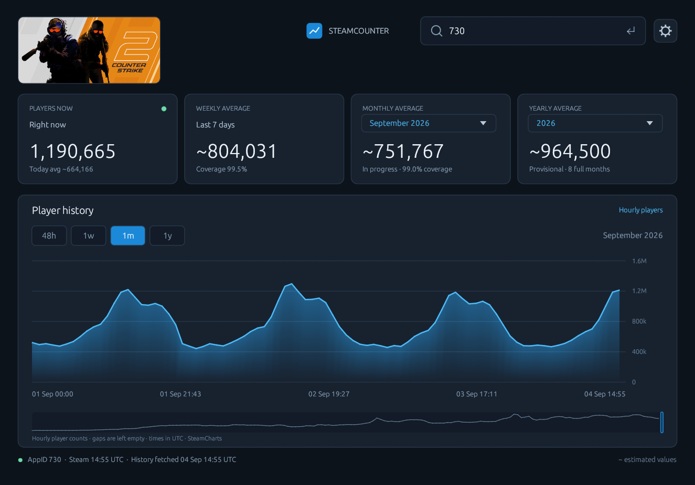

# SteamCounter

A lightweight Rust desktop app and CLI for Steam player counts, real charts and historical averages. Search by game name or AppID. No account, API key, embedded browser, telemetry or background collector.



## Download

Download **SteamCounter-1.1-windows-x64.exe** from [Releases](https://github.com/Matteo842/SteamCounter/releases/latest) and run it. It is a single portable desktop executable: no ZIP, installer or accompanying files are needed. License texts and dependency notices are embedded and available under **Settings → View licenses**.

Windows x64 is the tested release platform. Rust and build tools are only needed to compile the source. The executable is not code-signed. GitHub also provides automatic source-code archives; those are for developers and are not required to run the app.

## Desktop

- Type a game name or its Steam AppID and press **Enter**. Ambiguous searches show a list of matches.
- Search suggestions appear after a short pause while typing. Only standalone games are shown; DLC, demos, soundtracks and other non-game AppIDs are excluded using Steam Store metadata.
- Only one autocomplete search runs at a time. Repeated queries and previously checked AppID types reuse the in-memory session cache.
- The dashboard header shows the game's official Steam banner while keeping SteamCounter centered and the controls on the right.
- View players now, today's estimated average, the last 7 days, a selected month and a selected year. Month and year default to the current period.
- Switch between **48h**, **1w**, **1m** and **1y** without making additional requests. Hover over a chart point for its timestamp and value.
- The recent chart uses actual hourly player counts from SteamCharts. The yearly chart uses **published monthly averages**, not peaks. Missing hours and months remain empty.
- For an older month without hourly detail, the chart shows a single bar for its **published monthly average**. It does not invent a daily curve. The source exposes only about 30 recent days of hourly samples; part of a selected month may be missing.
- Current-year averages are provisional and include only available completed months, weighted by their number of days. The card reports how many months are included. Previous years require all 12 months.
- Open **Settings** to control local history storage. Click the SteamCounter name to return to the home screen.
- After your first successful search, the home shortcuts show **Last**: your three most recently opened games, newest first and without duplicates. Names and AppIDs are saved in settings across restarts, independently of the optional statistics cache.

## Optional local cache

Enable **Settings → Save history on this computer** to reuse fetched charts and averages across searches and application restarts. It is off by default.

| Data | Reuse policy |
| --- | --- |
| SteamCharts history | Saved locally and reused for one hour when enabled |
| Published months / yearly calculations | Included in the same history snapshot; changing selections makes no requests |
| Steam current count | Reused for up to 60 seconds in the current GUI session |
| Name searches | Debounced by 300 ms, limited to one active search and reused in memory for up to 24 hours in the current GUI session |
| Standalone/DLC classification | Checked once per previously unseen search result and reused for the current GUI session |

After expiry, history refreshes on the next search. If a refresh fails, saved history remains available and is clearly marked **stale**, with its original timestamp and a warning. Failed history requests are paused for at least 15 minutes when caching is enabled; a longer provider retry interval is respected. This reduces requests but cannot guarantee exemption from a provider's rate limits.

The history folder is limited to **50 MiB**. Oldest entries are removed when necessary. Files are validated and replaced atomically; corrupt entries are ignored and refreshed. This is a bounded cache of downloaded snapshots, not a permanent hourly archive or a server-side data collection service.

On Windows, data lives in `%LOCALAPPDATA%\SteamCounter`: `settings.json` stores the preference and `history-v1` holds per-game history. macOS uses `~/Library/Application Support/SteamCounter`; Linux uses `$XDG_DATA_HOME/SteamCounter` or `~/.local/share/SteamCounter`. `STEAMCOUNTER_DATA_DIR` can override the location.

Turning the option off stops cache reads and writes on subsequent requests. **Clear cache** deletes saved history while keeping the preference. An unwritable cache produces a warning and does not discard successfully fetched data. Nothing is uploaded from the cache.

## Command line

The CLI remains available in the source. Build it with `cargo build --release --locked --bin steamcounter`, then use `target/release/steamcounter.exe`. The downloadable release executable opens the desktop UI.

```powershell
.\steamcounter.exe 730
.\steamcounter.exe "elden ring" --stats
.\steamcounter.exe --search portal
.\steamcounter.exe 730 --month 2026-08 --year 2025
.\steamcounter.exe 730 --stats --cache
.\steamcounter.exe 730 --stats --no-cache --json
.\steamcounter.exe --help
```

The existing CLI commands are preserved. `--stats` adds historical averages; `--month YYYY-MM` and `--year YYYY` imply `--stats`. `--cache` and `--no-cache` override the saved GUI preference for that invocation. The CLI reads the current count directly from Steam each time; the 60-second in-memory reuse applies to the GUI.

An **AppID** identifies a game: `730` in `https://store.steampowered.com/app/730/`. A user's SteamID is not an AppID. Use `--search` to look up a game whose title consists only of digits. Name lookup uses the English Steam Store in the IT region; removed or region-restricted games may require a direct AppID.

The default timeout is 15 seconds per request, configurable with `--timeout 1..120`. Optional title lookup waits up to 5 seconds. A complete search may make multiple requests. HTTP 403/404/429 are reported rather than bypassed; there are no automatic polling loops.

### JSON

```powershell
.\steamcounter.exe 730 --json
.\steamcounter.exe 730 --stats --json
```

Basic output retains `appid`, `name`, `player_count` and `checked_at`. Search returns an array of games. Statistics return `appid`, `current`, `history`, `selected_month`, `selected_year` and `warnings`.

`history.samples` contains the retained hourly points; `history.cache_state` is `network`, `fresh` or `stale`. `history.retrieved_at` remains the original download time when cached data is used. Averages and their coverage are recalculated for the requested current UTC periods. A missing value is `null`, never an invented zero.

JSON goes to stdout; fatal errors go to stderr with a nonzero exit code. A partial result succeeds when at least one source is available and includes warnings. The CLI's yearly result still requires all 12 published months; the provisional current-year summary is a desktop feature.

## What the numbers mean

These are **concurrent players**, not unique daily or monthly users. Steam's current count is a snapshot, not today's average. Ready-made daily, weekly and current-month estimates come from SteamCharts hourly samples, so the app does not need to stay open.

All periods use **UTC**. The current month starts on the first day; it is not the last 30 days. Estimates marked `~` are time-weighted over available hourly intervals of 30–90 minutes. Missing intervals and unobserved edges are excluded rather than filled with zero. Coverage is reported on the cards or in their details. Annual estimates weight published monthly means by calendar days and remain approximate.

Data sources: [Valve's current-player endpoint](https://partner.steamgames.com/doc/webapi/ISteamUserStats#GetNumberOfCurrentPlayers), the Steam Store, and [SteamCharts](https://steamcharts.com/about). Store and SteamCharts endpoints are public but are not documented as stable APIs; formats and availability can change. See [data sources and methodology](docs/DATA_SOURCES.md).

SteamCounter is not affiliated with Valve, SteamCharts or SteamDB. Their names and data remain their respective owners' property.

## Build and develop

Rust/Cargo **1.88+**. Windows MSVC builds also need Visual Studio C++ Build Tools.

```powershell
# CLI only: no GUI dependencies are compiled
cargo run -- 730 --stats
cargo build --release --locked

# Native desktop app, using egui/eframe with OpenGL
cargo run --features gui --bin steamcounter-gui
cargo build --release --locked --features gui --bins

# Verification
cargo fmt --check
cargo test --locked
cargo test --features gui --locked
cargo clippy --features gui --all-targets --locked -- -D warnings
```

`target` holds compilation artifacts; these are not required to run the portable binaries. `--game 730` loads a game immediately. Demo mode is available only in development builds with the `gui-preview` feature; it is not part of the release app.

The clients are in `src/lib.rs` and `src/history.rs`; cache/settings in `src/cache.rs`; timestamp-aware chart series in `src/series.rs`; CLI in `src/main.rs`; native UI in `src/gui/`. Tests use local HTTP fixtures and synthetic data, including cache expiry, failure fallback, corrupt files, storage limits, missing intervals and monthly averages versus peaks.

`./scripts/package-windows.ps1` regenerates the embedded dependency notices, builds both binaries and copies the standalone GUI executable to `target/packages/SteamCounter-1.1-windows-x64.exe`. It prints a SHA-256 digest for the release notes; only the `.exe` is uploaded as a release asset. Packaging requires PowerShell 7, ripgrep and dependencies already fetched by Cargo (`cargo fetch --locked`); none are needed to run the app. Close any running copy from `target/release` before rebuilding.

When changing dependencies, run `./scripts/generate-notices.ps1` before building a release. The script includes runtime and build dependencies for Windows and deduplicates identical license texts. Notices are committed so ordinary source builds do not require PowerShell.

For native screenshots, build with `--features gui-preview --bin steamcounter-gui` and set `STEAMCOUNTER_SCREENSHOT_TO` to a PNG path. The app exits after capture and waits for `--game` results and layout first. `--compact`, `--preview-query name`, `--preview-range 1y`, `--preview-month YYYY-MM`, `--preview-year YYYY`, `--preview-settings` and `--preview-licenses gpl` (or `third-party`) are development preview options.

## License and source code

Copyright © 2026 Matteo842. SteamCounter's original code and documentation are licensed under **GNU GPL version 3 or, at your option, any later version** (`GPL-3.0-or-later`). See [LICENSE](LICENSE). SteamCounter is distributed without any warranty, including implied warranties of merchantability or fitness for a particular purpose.

You may use, modify and redistribute SteamCounter, including commercially, under those terms. When distributing a covered modified version, preserve the license and notices and provide its corresponding source under the GPL. Dependencies, fonts and other third-party materials retain their respective license terms; see [third-party notices](docs/third-party/THIRD_PARTY_NOTICES.txt).

The corresponding SteamCounter source and build scripts for each executable are in its matching Git tag, including `Cargo.lock`. The [dependency source index](docs/third-party/SOURCES.md) links the exact unmodified source archives for runtime and build dependencies; Cargo verifies their checksums from the lockfile. MPL-covered dependency archives are also mirrored under `docs/third-party/sources` and additionally distributed under GPL-3.0-or-later as part of the combined work, pursuant to MPL section 3.3. Original MPL notices and rights are preserved. The program's license does not grant rights to Steam or SteamCharts data or trademarks.
